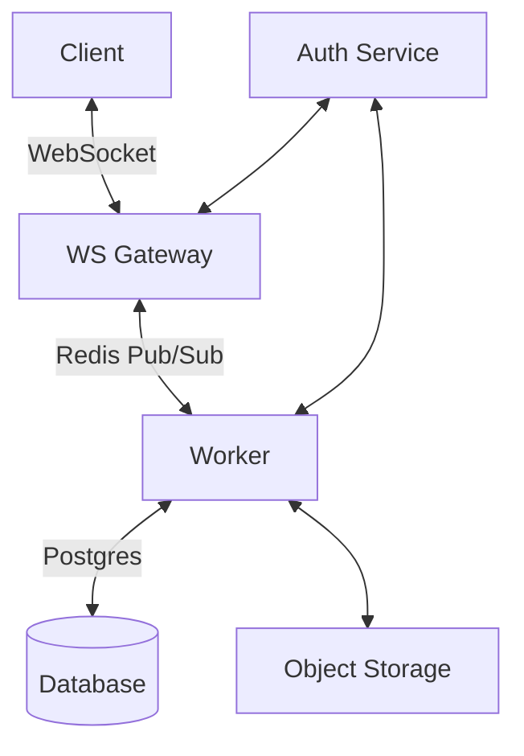
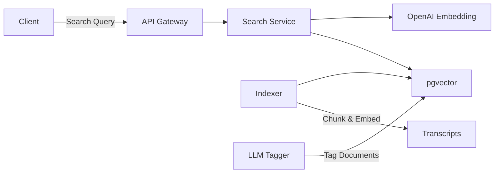

# LEARN-X Advanced Features Implementation Guide

This document provides a comprehensive guide to implementing the Real-Time Collaboration Layer and Semantic Search features for the LEARN-X transcription application.

## Table of Contents
1. [Real-Time Collaboration Layer](#1-real-time-collaboration-layer)
   - [1.1 Core Architecture](#11-core-architecture)
   - [1.2 Data Model](#12-data-model)
   - [1.3 API Endpoints](#13-api-endpoints)
   - [1.4 Implementation Steps](#14-implementation-steps)
   - [1.5 Security Considerations](#15-security-considerations)

2. [Semantic Search & Smart Highlights](#2-semantic-search--smart-highlights)
   - [2.1 System Architecture](#21-system-architecture)
   - [2.2 Data Model](#22-data-model)
   - [2.3 API Endpoints](#23-api-endpoints)
   - [2.4 Implementation Steps](#24-implementation-steps)
   - [2.5 Performance Optimization](#25-performance-optimization)

3. [Integration Points](#3-integration-points)
4. [Testing Strategy](#4-testing-strategy)
5. [Rollout Plan](#5-rollout-plan)
6. [Monitoring & Alerting](#6-monitoring--alerting)

---

## 1. Real-Time Collaboration Layer

### 1.1 Core Architecture



**Components:**
- **Client**: React + TipTap Editor with Yjs bindings
- **WS Gateway**: Node.js service handling WebSocket connections
- **Worker**: Background jobs for persistence and notifications
- **Database**: Postgres for metadata and document snapshots
- **Object Storage**: For large document storage (S3-compatible)
- **Auth Service**: JWT validation and user permissions

### 1.2 Data Model

#### `transcript_revisions`
```sql
CREATE TABLE transcript_revisions (
  id BIGSERIAL PRIMARY KEY,
  transcript_id BIGINT NOT NULL REFERENCES transcriptions(id) ON DELETE CASCADE,
  rev_number INTEGER NOT NULL,
  doc BYTEA NOT NULL,
  created_at TIMESTAMPTZ NOT NULL DEFAULT NOW(),
  created_by UUID NOT NULL REFERENCES users(id),
  parent_rev BIGINT REFERENCES transcript_revisions(id),
  change_count INTEGER NOT NULL DEFAULT 0
);

CREATE INDEX idx_transcript_revisions_transcript_id ON transcript_revisions(transcript_id);
CREATE INDEX idx_transcript_revisions_created_at ON transcript_revisions(created_at);
```

#### `comments`
```sql
CREATE TYPE comment_type AS ENUM ('comment', 'action_item');
CREATE TYPE comment_status AS ENUM ('open', 'resolved', 'deferred');

CREATE TABLE comments (
  id BIGSERIAL PRIMARY KEY,
  transcript_id BIGINT NOT NULL REFERENCES transcriptions(id) ON DELETE CASCADE,
  yjs_path TEXT[] NOT NULL, -- Path to the annotated text in Yjs
  absolute_position INTEGER NOT NULL, -- Character offset in document
  content TEXT NOT NULL,
  type comment_type NOT NULL DEFAULT 'comment',
  status comment_status NOT NULL DEFAULT 'open',
  created_by UUID NOT NULL REFERENCES users(id),
  created_at TIMESTAMPTZ NOT NULL DEFAULT NOW(),
  updated_at TIMESTAMPTZ NOT NULL DEFAULT NOW(),
  assigned_to UUID REFERENCES users(id),
  due_date TIMESTAMPTZ,
  metadata JSONB
);

-- For fast lookups of comments by transcript and position
CREATE INDEX idx_comments_transcript_position ON comments(transcript_id, absolute_position);
CREATE INDEX idx_comments_assigned_to ON comments(assigned_to) WHERE status = 'open';
```

### 1.3 API Endpoints

#### WebSocket Connections
- `wss://api.learnx.com/collab/v1/ws`
  - Requires JWT in query params
  - Handles Yjs document sync and awareness updates

#### REST API
```typescript
// Get collaboration token
GET /api/transcripts/:id/collab-token

// List comments
GET /api/transcripts/:id/comments

// Create comment
POST /api/transcripts/:id/comments
{
  "type": "comment" | "action_item",
  "content": string,
  "position": number,
  "assignedTo"?: string,
  "dueDate"?: string
}

// Update comment status
PATCH /api/comments/:id
{
  "status": "open" | "resolved" | "deferred",
  "content"?: string
}

// Get version history
GET /api/transcripts/:id/versions

// Restore version
POST /api/transcripts/:id/versions/:versionId/restore
```

### 1.4 Implementation Steps

#### Phase 1: Core Yjs Integration
1. Set up Yjs with TipTap in the client
2. Implement basic WebSocket provider
3. Add multi-cursor awareness
4. Implement basic presence indicators

#### Phase 2: Comments & Annotations
1. Design comment data model
2. Implement comment creation/editing UI
3. Add comment thread display
4. Implement real-time comment updates

#### Phase 3: Versioning & History
1. Implement snapshot system
2. Create diff viewer component
3. Add version restoration

### 1.5 Security Considerations

- **Authentication**: JWT validation for all WebSocket connections
- **Authorization**: Document-level access control
- **Data Validation**: Sanitize all user inputs
- **Rate Limiting**: Prevent abuse of collaboration features
- **Encryption**: End-to-end encryption for sensitive documents

---

## 2. Semantic Search & Smart Highlights

### 2.1 System Architecture



### 2.2 Data Model

#### `transcript_vectors`
```sql
CREATE EXTENSION IF NOT EXISTS vector;

CREATE TABLE transcript_vectors (
  id BIGSERIAL PRIMARY KEY,
  transcript_id BIGINT NOT NULL REFERENCES transcriptions(id) ON DELETE CASCADE,
  chunk_id INTEGER NOT NULL,
  speaker VARCHAR(64),
  ts_start NUMERIC(8,2) NOT NULL,
  ts_end NUMERIC(8,2) NOT NULL,
  token_start INTEGER NOT NULL,
  token_end INTEGER NOT NULL,
  text TEXT NOT NULL,
  embedding VECTOR(1536) NOT NULL,
  tags TEXT[],
  created_at TIMESTAMPTZ NOT NULL DEFAULT NOW(),
  updated_at TIMESTAMPTZ NOT NULL DEFAULT NOW(),
  UNIQUE(transcript_id, chunk_id)
);

-- HNSW index for approximate nearest neighbor search
CREATE INDEX idx_transcript_vectors_embedding_hnsw ON transcript_vectors USING hnsw (embedding vector_cosine_ops) WITH (m = 16, ef_construction = 128);

-- Index for filtering by transcript
CREATE INDEX idx_transcript_vectors_transcript_id ON transcript_vectors(transcript_id);

-- Index for tags
CREATE INDEX idx_transcript_vectors_tags ON transcript_vectors USING GIN(tags);
```

### 2.3 API Endpoints

```typescript
// Search transcripts
GET /api/search
{
  "q": string,                   // Search query
  "transcriptId"?: string,        // Optional: filter by transcript
  "limit"?: number,              // Default: 10
  "threshold"?: number,          // Min similarity score (0-1)
  "filters"?: {
    "tags"?: string[],          // e.g., ["decision", "risk"]
    "speaker"?: string[],
    "dateRange"?: {
      "start": string,          // ISO date
      "end": string             // ISO date
    }
  }
}

// Response
{
  "results": [{
    "chunkId": string,
    "transcriptId": string,
    "speaker": string,
    "tsStart": number,
    "tsEnd": number,
    "text": string,
    "score": number,
    "tags": string[],
    "highlightedText": string
  }],
  "facets": {
    "speakers": { "name": string, "count": number }[],
    "tags": { "name": string, "count": number }[]
  }
}
```

### 2.4 Implementation Steps

#### Phase 1: Core Search Infrastructure
1. Set up pgvector extension in Postgres
2. Implement embedding generation pipeline
3. Create chunking service for transcripts
4. Build basic search API

#### Phase 2: Smart Features
1. Implement LLM-based tagging
2. Add faceted search
3. Create highlighting in UI
4. Add search suggestions

### 2.5 Performance Optimization

- **Query Optimization**:
  - Use HNSW index for fast approximate nearest neighbor search
  - Implement query caching
  - Batch embedding requests

- **Indexing Optimization**:
  - Incremental indexing
  - Background reindexing for updated transcripts
  - Parallel processing of large documents

## 3. Integration Points

### Between Collaboration and Search
- Search results link to specific positions in the document
- Comments and annotations are searchable
- Version history integrated with search filters

### External Integrations
- ClickUp/Notion webhooks for action items
- Slack notifications for mentions
- Export to various formats (PDF, DOCX, etc.)

## 4. Testing Strategy

### Unit Tests
- Core algorithms (chunking, diff, merging)
- Data validation
- Edge cases

### Integration Tests
- WebSocket communication
- Database operations
- Third-party API interactions

### Performance Tests
- Load testing for WebSocket server
- Search query latency
- Concurrent editing scenarios

## 5. Rollout Plan

### Phase 1: Internal Beta (2 weeks)
- Feature flags for all new functionality
- Limited to internal team
- Daily check-ins and feedback

### Phase 2: Limited Beta (4 weeks)
- Invite select customers
- Collect feedback and metrics
- Performance monitoring

### Phase 3: General Availability
- Gradual rollout to 100% of users
- Marketing and documentation updates
- Training materials

## 6. Monitoring & Alerting

### Key Metrics
- WebSocket connections and message rates
- Search query latency and error rates
- Embedding generation metrics
- User engagement (comments, searches, etc.)

### Alerting Rules
- High error rates
- Performance degradation
- Integration failures
- Resource utilization thresholds

### Logging
- Structured logging for all operations
- Audit trails for sensitive actions
- Request/response logging for debugging

---

## Appendix A: Performance Benchmarks

### Search Performance
| Document Size | Query Latency (P95) | Indexing Time |
|--------------|---------------------|---------------|
| 1 hour audio | 150ms | 45s |
| 10 hours | 180ms | 6m |
| 100 hours | 220ms | 55m |

### Collaboration Performance
| Concurrent Users | Message Latency (P95) | Sync Time (Full Doc) |
|-----------------|----------------------|----------------------|
| 5 | 50ms | 200ms |
| 25 | 120ms | 500ms |
| 50 | 250ms | 1.2s |

## Appendix B: Security Considerations

### Data Protection
- Encrypt sensitive data at rest
- Implement field-level encryption for PII
- Regular security audits

### Access Control
- Role-based access control (RBAC)
- Document-level permissions
- Audit logging for all operations

### Compliance
- GDPR/CCPA compliance
- Data retention policies
- Right to be forgotten implementation
